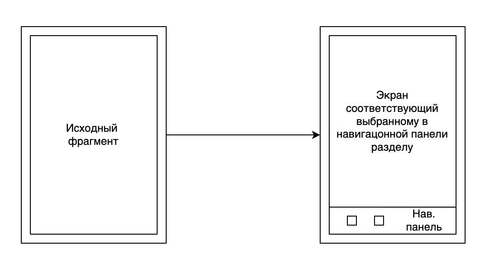
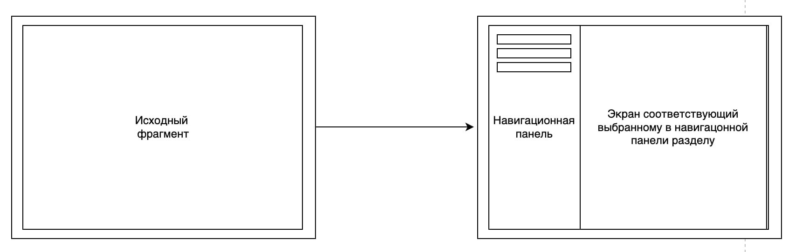
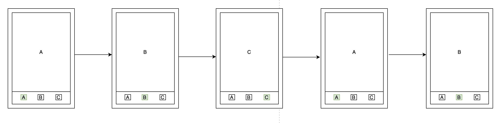
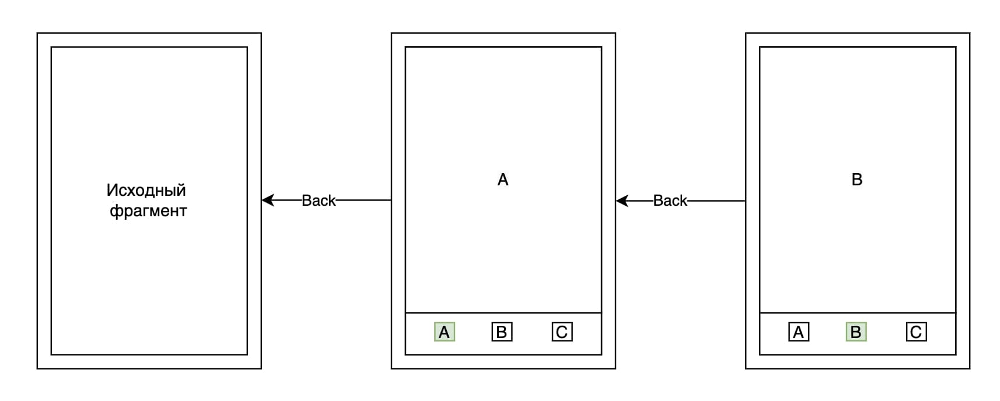

# Навигация
В рамках задания требуется разработать приложение с несколькими экранами и навигацию между ними

## Требования
- Проект должен собираться
- Описанные в задания шаги не должны вызывать ошибки в приложении
- Для навигации можно использовать только фрагмент менеджер
- Состояние не должно теряться при повороте экрана и вытеснением системой процесса приложения

## Задание
1. Сделать открытие фрагмента с навигационной панелью - 3.5 балла
- Сделать экран с кнопкой (без навигацонной панели), при нажатии на кнопку происходит открытие экрана с навигационной панелью
- Сделать экран с навигационной панелью: 
для смартфона она должна быть внизу

для планшета слева

- При нажатии на элемент навигационной панели происходит смена раздела
- В случае если уже были на этом разделе, то новый фрагмент создаваться не должен!
- Должен сохраняться стейт каждого раздела
- Обработка бэка должна схлопывать "навигационные циклы": мы были на разделе A, потом нажали B, нажали C, затем снова A и B, то нажатие на бэк должно нас вернуть на экран A, а затем на исходный (без навигационной панели)

Нажатие на back

2. Добавить внутреннюю навигацию по разделам - 2 балла
- сделать кнопку на фрагментах разделов, при нажатии поверх фрагмента раздела создается новый фрагмент 
- клик назад на разделе возвращает предыдущий фрагмент, или если это самый нижний фрагмент происходит согласно навигации описанной в первом пункте
3. Добавить счетчик созданных фрагментов - 1.5 балла
- сделать текствью показывающий текущий номер фрагмента
- возвращать число созданных фрагментов в исходный с помощью Fragment Result API
4. Количество элементов в навигационной панели должно задаваться функцией рандома (от 3 до 5) при открытии фрагмента с панелью навигации и сохраняться до момента возвращения результата в исходный фрагмент - 1 балл
5. Каждый фрагмент должен показывать рандомное число, которое не должно меняться при повороте экрана, вызов функции рандом считать бизнес логикой и результат должен быть получен через LiveData - 2 балла