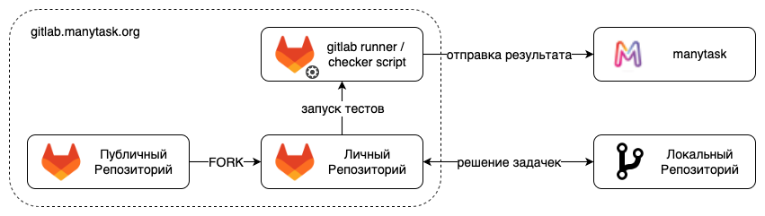

## Альтернативный трек: Помощь Manytask

`python` `testing` `litestar` `gitlab-actions` `gitlab-ci`

Есть другой, более интересный вариант третьей большой домашки - вы можете сделать не игрушечный проект, а помочь нашей системе стать чуточку лучше и удобнее.

Увы, поскольку он не учебный, то в целом это будет сложнее потому что (как в жизни) вам нужно будет читать чужой хреновый код, придумывать как сделать штуку которая ещё не сделана и тд.   
Да и в целом проект ещё довольно не сформирован и среди хаоса и обломков империй нужно будет понимать что и как.  
Но зато это будет полезно и, надеюсь, интересно =)

**Важно:** Количество мест ограничено. Если вы хотите делать "альтернативный трек", то это нужно согласовать в первую неделю после выдачи с @k4black (написать в tg). 

---

## Контекст 

### Manytask и Checker

Manytask - это система для автоматизации проверки домашек, в целом она состоит из двух частей:

1. [checker](https://github.com/manytask/checker) -
  питонячий скрипт, который запускается в ci, прогоняет тесты и отправляет на сервер результат - название задачки, балл, время отправки.
2. [manytask](https://github.com/manytask/manytask) - 
  веб-морда, принимает оценки, проверяет дедлайн и выставляет в табличку. Отвечает checker что всё ок или не ок (синий цвет в конце логов) 

Изначально эта система представляла собой практически 2 огромных файла, которые поддерживал Федя (т.ч. ведёт курс го). Позже была разделена на вот эту структуру, добавлены новые фичи и тд.
Поэтому текущая версия во многом опиралась на старую структуру и уже начала сталкиваться с проблемами которые сложно решить.

Поэтому сейчас мы делаем обновление системы, буквально переписываю её с нуля.
Это довольно сложный процесс и тут нам пригодится ваша помощь! 

### Репозитории

Если говорить про то как изнутри это работает, можно обратиться к картинке из ридми

На самом деле на неё не нарисован ещё один репозиторий - `private`, в котором лежат все приватный и публичные тесты, решения и темплейты.

Общий флоу выглядит вот так: 
* приватный репозиторий обновляется преподами.
* checker копирует из него публичные тесты и темплейты в публичный репозиторий.
* manytask когда студент зарегистрировался, создаёт ему личный репозиторий, который является форком от публичного.
* студенты делают задачки и отправляют на проверку.
* в их ci/cd запускается checker, который запускает тесты и отправляет результаты на сервер.
* сервер принимает результаты, проверяет дедлайн и выставляет баллы в табличку.

## Что делаем

Как упомянуто выше, буквально передумываем и переписываем систему с 0.  
Из основных направлений:

Checker
* Убрать все костыли и удалить deprecated фичи.
* Отрефакторить структуру всего пакета.
* Использовать minijail для изоляции.
* Писать так, чтобы код сразу был покрыт тестами.

Manytask
* Перейти на асинхронный фреймворк (litestar).
* Сделать один инстанс manytask для всех курсов.
* Добавить rabbitmq (celery) для батчевой проставке скора и для антиплагиата. 
* (backlog) Прикрутить нормальную бд (не реляционную).
* (backlog) Добавить ботика для досылки уведомлений об обновленных задачках.

И общее - собрать документацию со всем сервисов в одно место и захостить в github pages.

## Что делать

У нас есть беклог задач, которые нужно сделать - [Manytask Project](https://github.com/orgs/manytask/projects/1/views/1).

Вам нужно выбрать 3 любые задачки колонки `TODO` чтоб их решить, согласовать с @k4black и сделать. 
Рекомендуется выбирать задачки из репозитория `checker` потому что новая версия `manytask` ещё далека от MWP (но если есть желание его делать, то я рад)  

Как изъявите желание соберем с людьми звонок, обсудим что и как делать, как легче подступиться и тд.

## Баллы

Вы можете получить полный набор баллов за HW3 - 400 + 50 бонуса. 

Оценка тут довольно субъективная, но в целом критеии оценки выглядят так:
* Вы делайте задачки и получайте 400 баллов.
* Вы делайте их хорошо и тратите меньше времени преподавателя - получаете бонусные 50 баллов.
As simple as that.
